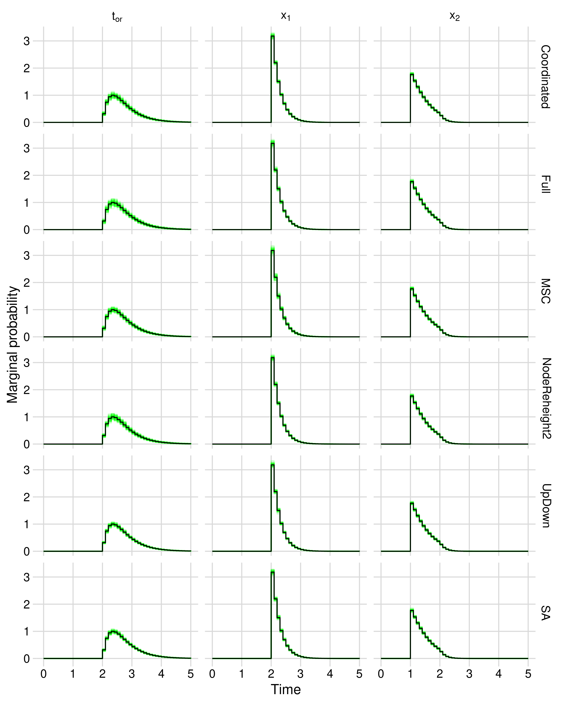

# StarBEAST2 FBD-MSC correctness

## Introduction

The aim of this analysis is to check the mathematical correctness of the
FBD-MSC implementation in StarBEAST2. For the implementation to be correct,
the probability density calculated for a proposed species and gene trees given
the fossilized birth death model and multispecies coalescent model must be
correct. In addition, for each MCMC operator, the proposal distribution must
be symmetric or the Hastings ratio calculated for that operator must be
correct.

There are three relevant sets of operators to check; BEAST2 operators,
StarBEAST2 operators, and Sampled Ancestor operators. The FBD-MSC
implementation in StarBEAST2 uses operators from all three sets.

By checking estimated species tree topology and time distributions using
different combinations of operators against the true distributions, we can
confirm that the probability density calculation and operators used are
mathematically correct.

## Operators

Apart from UpDown, which is used to change both species and gene trees, BEAST2
tree operators are only used to change the gene trees in our FBD-MSC
implementation. These operators are TreeScaler, TreeRootScaler, Uniform,
SubtreeSlide, Narrow, Wide, and WilsonBalding. The BEAST2 Scale operator is
used to change the other real parameters of the model, e.g. the origin height.
See [Drummond & Bouckaert (2015)](https://www.beast2.org/book/) for more
information.

The Sampled Ancestor operators are used to change the species tree. They are
LeafToSampledAncestorJump, SATreeScaler, SATreeRootScaler, SAUniform,
SANarrow, SAWide and SAWilsonBalding. See
[Gavryushkina *et al.* (2014)](https://doi.org/10.1371/journal.pcbi.1003919)
for more information.

One class of StarBEAST2 operators are the Coordinated operators,
which make coordinated changes to the heights of species and gene tree nodes.
CoordinatedUniform changes the height of a single non-root internal species
tree node, and CoordinatedExponential changes the height of the species tree
root node. See [Ogilvie *et al.* (2017)](https://doi.org/10.1093/molbev/msx126)
for more information. These operators have been modified to only change the
height of nodes corresponding to true bifurcations in the species tree, i.e.
not a sampled ancestor node.

The other StarBEAST2 operator is NodeReheight2, which improves TREE SLIDE,
developed by Joseph Heled and based on the ideas of
[Mau *et al.* (1999)](https://doi.org/10.1111/j.0006-341X.1999.00001.x).
See section 3.4.1 of Heled's 2011 PhD thesis "Bayesian Computational Inference
of Species Trees and Population Sizes" for more information.
In StarBEAST2 v15.5 TREE SLIDE has been reimplemented from scratch and made
compatible with fossil/ancient taxa including sampled ancestors. To stay
backwards compatible with previous versions of StarBEAST2, it is called
NodeReheight2, the name of a similar operator that only works on ultrametric
trees.

## Model parameters

We replicated the analysis in
[Gavryushkina *et al.* (2014)](https://doi.org/10.1371/journal.pcbi.1003919)
Supporting Information, "Testing operators". The model parameters are:

* Birth rate = 2
* Death rate = 1
* Sampling rate = 0.5
* Removal probability = 0.9
* Time of origin ~ Uniform(0, 1000)

Three species are included with fixed dates y1 = 2, y2 = 1, and y3 = 0. A
maximum of three real parameters are sampled; the time of origin and two
bifurcation times. If the species serially sampled at y1 or y2 are sampled
ancestors, then there will only be one or zero bifurcation times to estimate.
There are eight possible topologies given two fossil/ancient species, and
Gavryushkina *et al.* (2014) calculated their true probabilities (absent
any data) as:

| Topology | Newick string | Probability % |
|----------|---------------|---------------|
| T1       | ((3,2),1)     |       77.8327 |
| T2       | ((3,2)1)      |        7.8642 |
| T3       | ((3)2,1)      |        3.8657 |
| T4       | (3,(2,1))     |        4.3189 |
| T5       | ((3,1),2)     |        4.3189 |
| T6       | (((3)2)1)     |        0.4135 |
| T7       | (3,(2)1)      |        0.6930 |
| T8       | ((3)1,2)      |        0.6930 |

As the coalescent probability densities are conditioned on the species tree,
the FBD-MSC model is hierarchical and absent any data the addition of one or
more gene trees to the model should not change the distribution of species
tree topologies or times.

## BEAST2 and StarBEAST2 configurations

Keeping the above model parameters constant, we set up six different BEAST2
analyses, each with a different combination of operators:

* SA: Sampled Ancestor operators applied to a single tree (no gene trees were part of the model and StarBEAST2 was not activated)
* UpDown: The same as SA, but with the UpDown operator enabled for the species tree
* MSC: StarBEAST2 with one gene tree, but only BEAST2 and Sampled Ancestor operators were used, no StarBEAST2 operators were enabled
* Coordinated: StarBEAST2 with one gene tree, and only the Coordinated, BEAST2 and Sampled Ancestor operators were used, NodeReheight2 was not enabled.
* NodeReheight2: StarBEAST2 with one gene tree, and only the NodeReheight2, BEAST2 and Sampled Ancestor operators were used, Coordinated operators were not enabled.
* Full: StarBEAST2 with one gene tree, all operators were used.

For each configuration, we ran 100 replicate MCMC chains with different random
seeds. Each chain was run for 2.5 million states, with a burnin of 0.5 million
states, sampling once every 100 states. Therefore 20000 post-burnin
posterior samples were collected per replicate chain.

## Topology distributions

Given *n* independent trials with probability of success *p*, the number of
"successes" should follow the binomial distribution parameterized by *n* and
*p*. Therefore for each topology, the range defined by the 2.5th and 97.5th
percentile of a binomial distribution with the parameter values *n* =
effective sample size (ESS) and *p* = the true probability of a topology,
after normalization by the effective sample size, should contain the estimated
probability of that topology 95% of the time.

For each MCMC chain we calculated the estimated probability of each topology
as the number of observations of that topology divided by the total number of
samples. We also calculated the autocorrelation time for each topology in each
chain by coding samples containing that topology as 1 and all other samples as
0, then using the `integrated_autocorrelation_time` function from
[pymcmcstat](https://github.com/prmiles/pymcmcstat).
This function is based on Sokal (1989). The ESS for each topology in a chain
is simply the raw number of samples divided by the estimated autocorrelation
time.

For each topology in each configuration, we counted the number of replicate
chains for which the estimated probability of that topology was within the 95%
interval. As expected given a correct implementation of the model, these sums
were all around 95 (out of 100 replicate chains each).

| Configuration | T1 | T2 | T3 | T4 | T5 | T6 | T7 | T8 |
|---------------|----|----|----|----|----|----|----|----|
| SA            | 95 | 95 | 97 | 91 | 95 | 95 | 95 | 98 |
| UpDown        | 94 | 97 | 95 | 97 | 96 | 95 | 94 | 93 |
| MSC           | 92 | 96 | 95 | 97 | 93 | 95 | 95 | 93 |
| Coordinated   | 96 | 95 | 93 | 95 | 90 | 95 | 97 | 97 |
| NodeReheight2 | 95 | 98 | 94 | 96 | 97 | 96 | 95 | 95 |
| Full          | 91 | 92 | 94 | 96 | 97 | 98 | 99 | 96 |

## Time distributions

Fundamentally, MCMC is an algorithm for performing difficult high dimensional
integrations, e.g. calculating the marginal probability distribution of the
height of a node in a phylogenetic tree. For the species tree topologies in
this analysis we are estimating a maximum of three real parameters, so it is
not necessary to use MCMC and we can use an alternative implementation of the
FBD to calculate the marginal probability distributions of those real
parameters. If both our MCMC and non-MCMC implementations are correct, the
estimated distributions should be identical (up to some small error term).

We reimplemented the FBD for the most probable species tree topology given our
model, which is encoded by the Newick string ((3,2),1). This implementation
was written in Python 3 using the SciPy library, which calls the QUADPACK
library to integrate over any interval using adaptive or non-adaptive
quadrature.

For each real parameter (the time of origin, the root node height x1, and the
non-root internal node height x), separately for each replicate MCMC chain, we
calculated probability masses conditioned on the T1 species tree topology.
Masses were calculated for 100 equal width intervals (0.1 time units each)
between 0 and 10. For each interval we recalculated the same probability
masses using our quadrature implementation.

For each real parameter and MCMC configuration, we plotted the marginal
probability density of the quadrature integration as a black line, and the
marginal probability densities calculated from corresponding replicate chains
as green lines:

For each MCMC configuration and real parameter, the marginal probability
densities calculated using quadrature were in the middle of the range of
marginal probability densities calculated using the replicate chains. This is
strong evidence for the correctness of StarBEAST2 for sampled ancestors.

## Scripts

* `integrate-fbd.py`: Calculates probability masses using quadrature integration
* `prepare-correctness.py`: Prepares replicate chain files and kickoff scripts from the supplied XML templates
* `kickoff.sh`: Runs BEAST for each replicate chain
* `read-trees.py`: For each MCMC chain, extracts the species tree topology and times for each MCMC sample using the DendroPy library
* `summarize-trees.py`: Calculates probability masses from the topologies and times extracted from the MCMC chains
* `make-table.py`: Makes the table of counts of within-95%-interval topology probabilities
* `plot-marginals.R`: Plots the real parameter marginal densities
* 